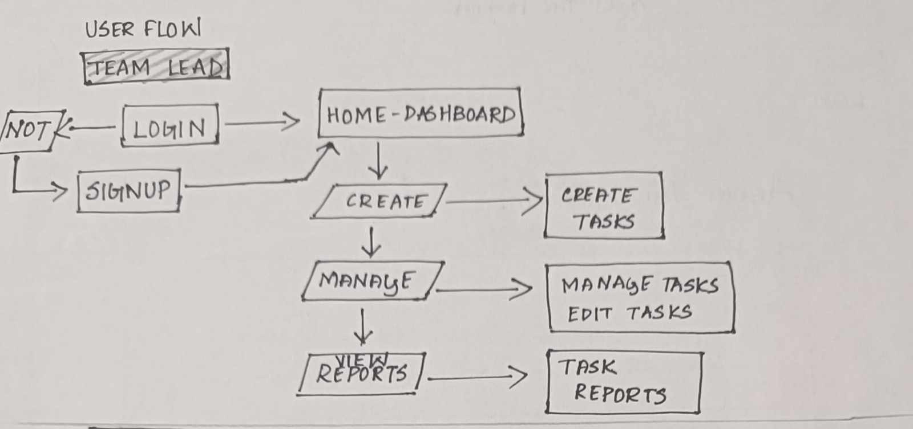
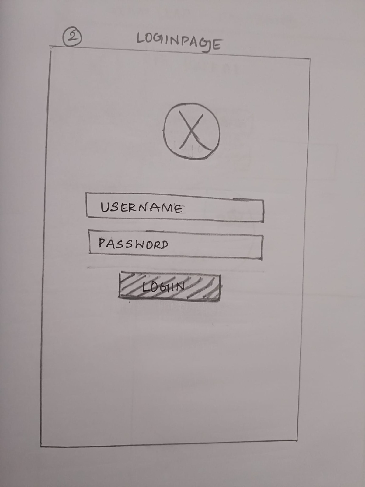
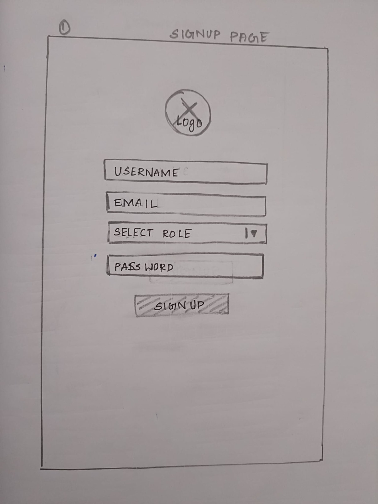
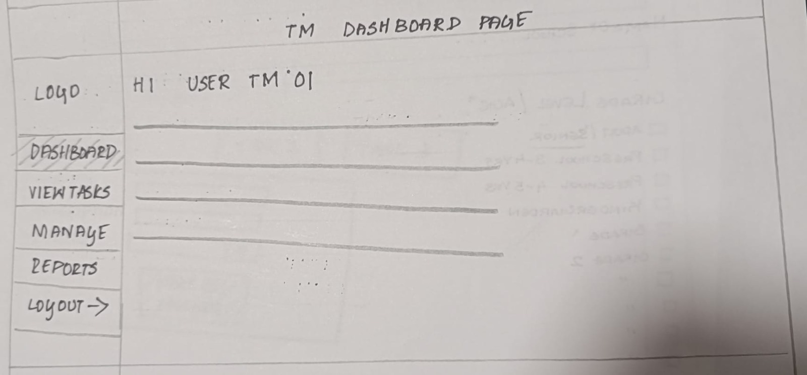

# Contributor: Varunkanth

## PROJECT TOPIC: AI-Powered Smart Task Management System (STMS) - GROUP 5

# Contributions

- **Designed system flowcharts**, wireframes, and detailed UI/UX mockups for the project to ensure clarity and efficient navigation.

- **Created the project README**, documentation, and layout guides to provide clear instructions and guidelines for developers and users.

- **Researched and planned feature workflows**, ensuring a smooth user experience and logical progression throughout the application.

- **Assisted in styling and layout for responsive UI**, ensuring the project is mobile-friendly and user-centric.

- **Supported testing and interface usability** for the final submission, identifying and resolving issues for better performance and user experience.

- **Managed initial user login logic** and role flow analysis, allowing for secure access control and user role management.

## Userflow

The userflow visually maps out the journey of different user roles—**Admin**, **Team Lead**, and **Team Member**—within the Smart Task Management System (STMS) platform. It outlines the user interactions from login/signup to task management functionalities. This ensures clarity in roles and helps streamline development and testing.

### Admin Flow
- Login/Signup via Google Authentication
- Access Dashboard
- Create new user accounts (Team Lead, Team Member)
- Monitor and reassign tasks
- View reports and overall progress

### Team Lead Flow
- Login/Signup
- Navigate to Dashboard
- Create and assign tasks
- Manage/edit tasks (update priority, deadline, status)
- View task reports

### Team Member Flow
- Login/Signup
- Access Dashboard
- View tasks assigned to them
- Update task status (To Do → In Progress → Completed)
- Comment on tasks

### Hand-drawn Flow Example (UserFlow)

User Flow 

Team Member

## Wireframe

The wireframe serves as the blueprint for the application’s UI/UX design. It outlines the structure of major screens and the user interface elements that make up the STMS platform.

### Key Screens

- **Login/Signup Page**  
  - Uses Google Authentication for secure access.
- **Dashboard**
  -  - Displays tasks categorized as *To Do*, *In Progress*, and *Completed* for better visualization.
- **Task Detail Page**  
  - Includes task description, assigned members, priority level, due date, and a comment section for collaboration.

Each screen layout emphasizes:
- Simplicity  
- Usability  

This structure ensures fast development and smooth user testing in later stages.

### Wireframe Snapshots (Add Images Below)

### Continuous Deployment

Once all tests pass, the application is automatically deployed using **GitHub Actions** to platforms such as:

- [Netlify](https://www.netlify.com)

This ensures that the latest stable version of the app is always live without manual intervention.

#### GitHub Actions Deployment Example Netlify

name: Deploy to Netlify

on:
  push:
    branches:
      - main

jobs:
  deploy:
    runs-on: ubuntu-latest

    steps:
      - name: Checkout code
        uses: actions/checkout@v2

      - name: Set up Node.js
        uses: actions/setup-node@v2
        with:
          node-version: '14'

      - name: Install dependencies
        run: |
          npm install

      - name: Build the project
        run: |
          npm run build

      - name: Deploy to Netlify
        uses: netlify/actions/cli@v2
        with:
          deploy-url: https://api.netlify.com/build_hooks/${{ secrets.NETLIFY_BUILD_HOOK }}
        env:
          NETLIFY_AUTH_TOKEN: ${{ secrets.NETLIFY_AUTH_TOKEN }}

---